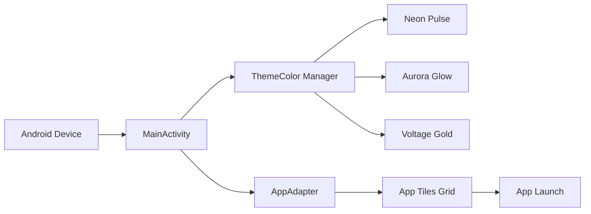

# Virusi Mbaya Launcher - Android APK

A custom Android launcher app with dynamic themes and app tiles.

## Build APK

### Prerequisites
- Android Studio 2023.1.1 or later
- Android SDK (API level 24+)
- Java 11+

### Steps

1. Open Android Studio
2. Select "File" → "Open" → select the `android/` folder
3. Wait for Gradle sync to complete
4. Select "Build" → "Build Bundle(s)/APK(s)" → "Build APK(s)"
5. APK will be generated in `android/app/build/outputs/apk/debug/app-debug.apk`

### Release APK (Signed)

1. Go to "Build" → "Generate Signed Bundle / APK"
2. Create a new keystore or select existing
3. Fill in keystore details
4. Select "APK" and build variant
5. Click "Finish"

### Install on Device

```bash
adb install android/app/build/outputs/apk/debug/app-debug.apk
```

## Features

- ✉ Messages
- 📷 Camera  
- ♫ Music
- ⚙ Settings
- 🖼 Gallery
- ☎ Contacts
- ☀ Weather
- 📍 Maps
- 💳 Banking

## Themes

- **Neon Pulse** - Pink neon on dark
- **Aurora Glow** - Cyan on dark
- **Voltage Gold** - Gold on dark

## Architecture


