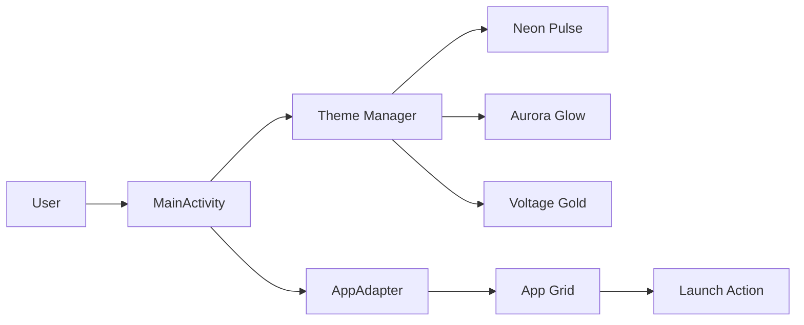

# Virusi Mbaya Launcher

A premium-style Android launcher project designed as a real APK-ready app.

## Build

1. Open the `android/` folder in Android Studio.
2. Let Gradle sync.
3. Select Build > Build APK(s).
4. APK output: `android/app/build/outputs/apk/debug/app-debug.apk`

## Features

- Premium dark phone UI
- Theme switching
- App grid with search
- Live clock
- App launch mockup
- Android-style launcher design

## Architecture

