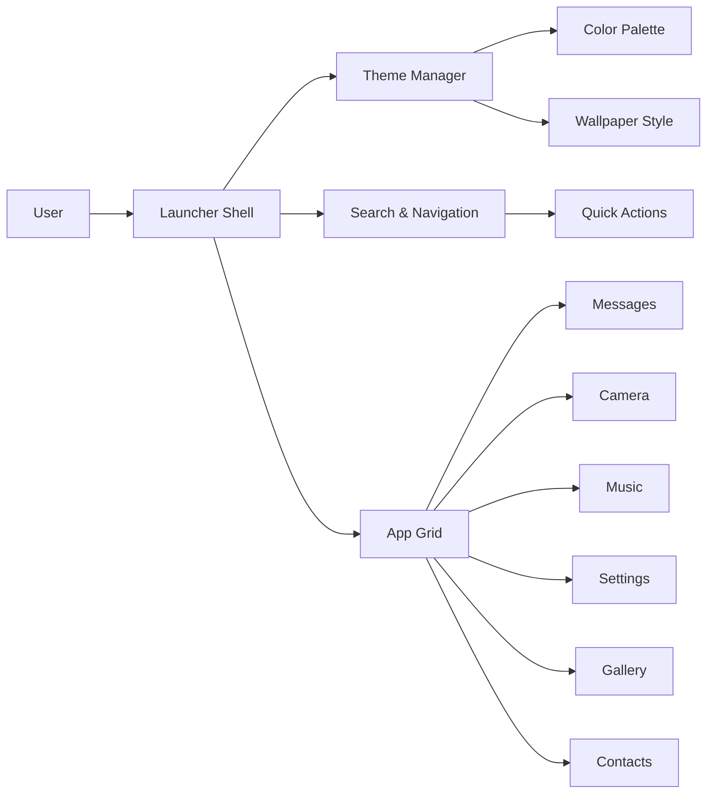

# Virusi Mbaya Launcher

A Java-based custom theme launcher mockup with a vivid neon interface, app tiles, and theme switching.

## Architecture Overview



## Features

- Custom theme switching
- Rounded app tiles
- Search panel
- Neon/glass modern styling
- Java Swing interface

## Run

```bash
mvn clean package
java -jar target/virusi-mbaya-launcher-1.0.0.jar
```

Or directly:

```bash
mvn exec:java
```
