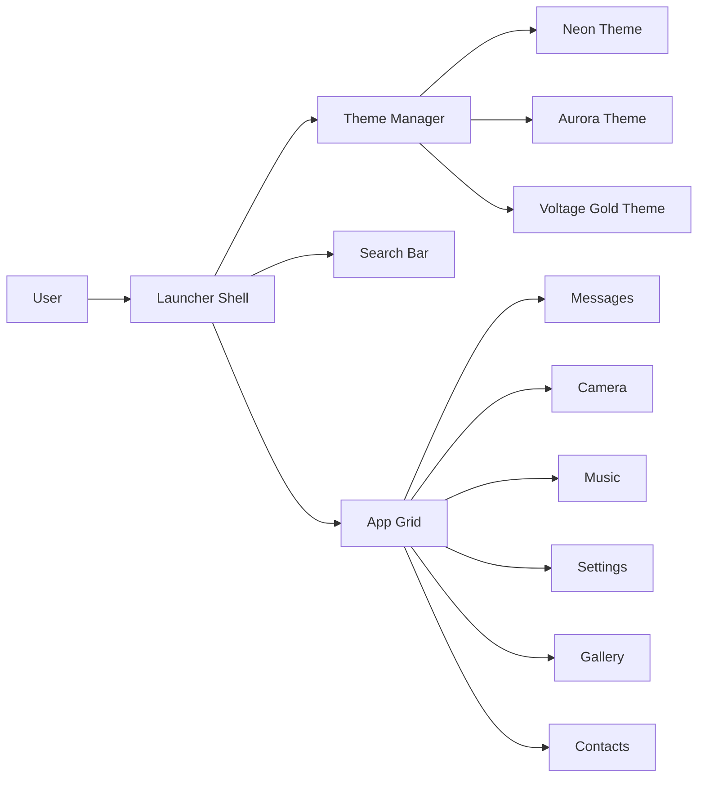

# Virusi Mbaya Launcher

A full Java Swing launcher application with a custom neon theme, app grid, search bar, theme picker, and interactive app tiles.

## Architecture Overview



## Features

- Custom color themes
- Rounded app tiles
- Search field and launcher look
- Real-time clock
- App launch popups
- Java Swing interface

## Run

```bash
mvn clean package
java -jar target/virusi-mbaya-launcher-1.0.0.jar
```

Or:

```bash
mvn exec:java
```
